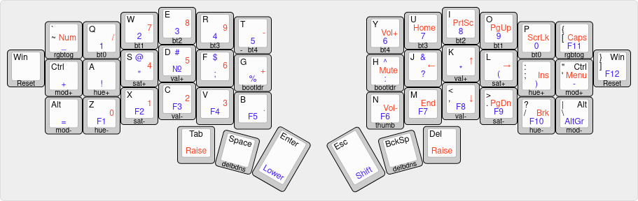

# Improved Jorne Firmaware 

Its improved firmware for [Jorne](https://github.com/joric/jorne).
Here used newer oleds API, and improved keymap.



## Installing
1. At first install [qmk](https://qmk.fm/)
2. Copy this repo in `qmk/keyboards/crkbd/keymaps`
3. In `qmk/` directory use

For the left half of keyboard:

```sudo make crkbd:improved_jorne:avrdude-split-left```

For the right half of keyboard:

```sudo make crkbd:improved_jorne:avrdude-split-right```
